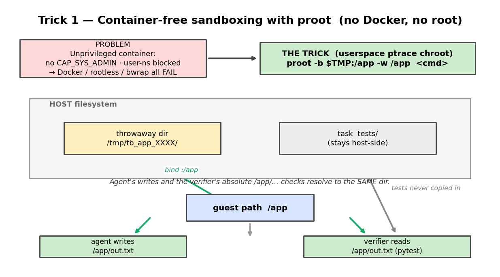
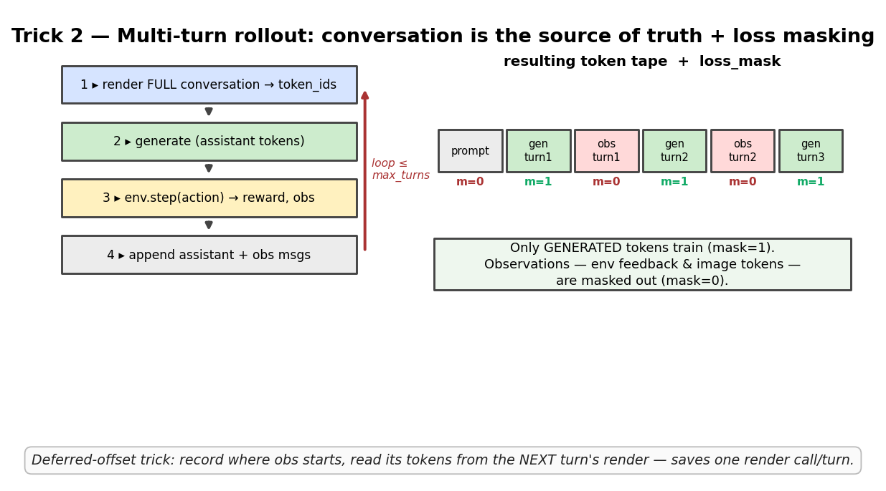
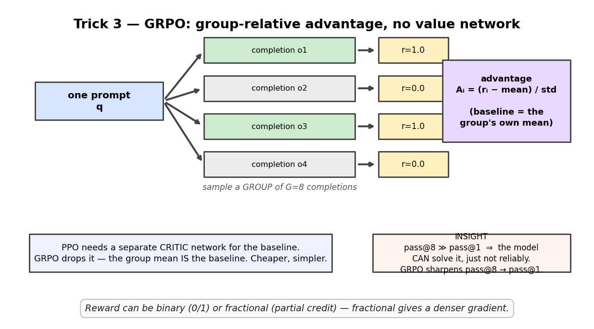
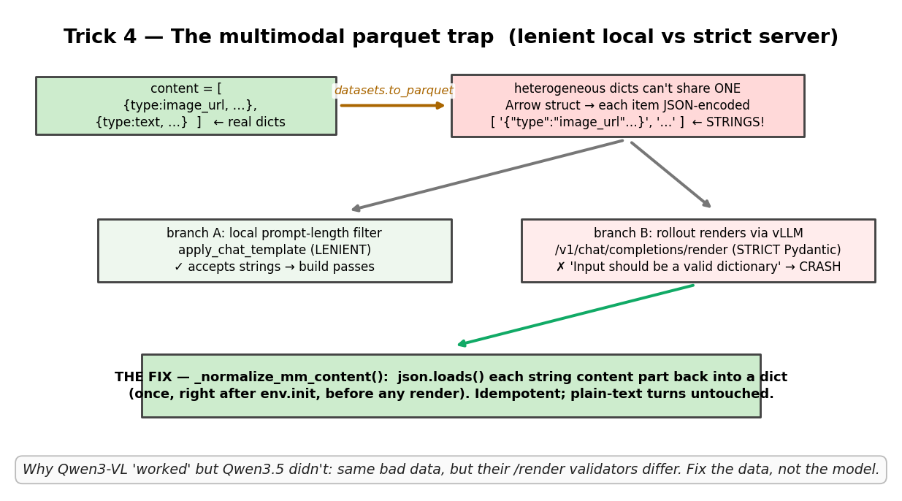
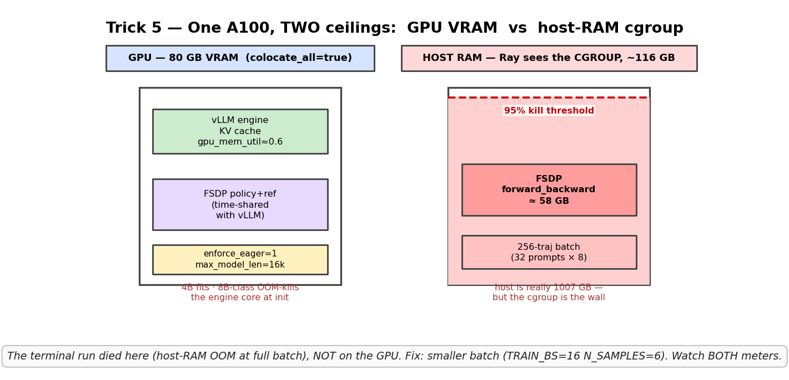
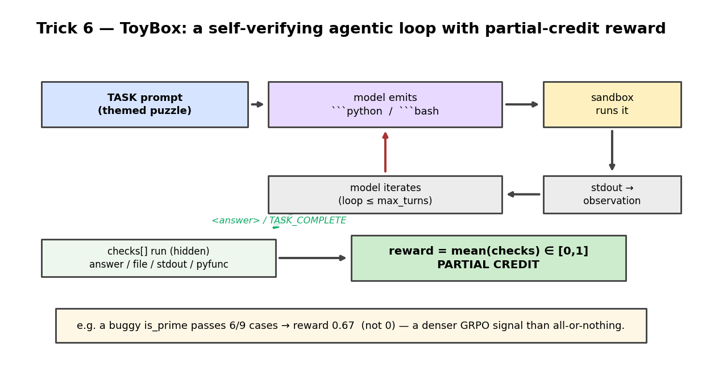

# Learn the Tricks — a visual field guide 🎨

Six diagrams, one trick each. Skim the picture, read the three bullets, follow the
code pointer if you want the details. Figures live in `figures/learn/` (regenerate
with `tbench-venv/bin/python make_learning_figures.py`).

---

## Trick 1 — Container-free sandboxing with `proot`


- This box has **no `CAP_SYS_ADMIN` and blocks user namespaces** → Docker, rootless, bubblewrap all fail.
- `proot -b $TMP:/app -w /app` is a **userspace ptrace chroot** (zero privilege): it binds a throwaway temp dir to the guest path `/app`.
- The agent's writes to `/app/…` and the verifier's absolute `/app/…` pytest checks resolve to the **same dir**; the task's `tests/` stay host-side so the model can't peek.
- 📂 `SkyRL/skyrl-gym/skyrl_gym/envs/terminal/sandbox.py`

---

## Trick 2 — Multi-turn rollout = conversation as source of truth + loss masking


- Each turn: **render the full conversation → generate → `env.step` → append assistant + observation**, then loop.
- The reward only trains the model on tokens **it generated** (`loss_mask=1`); observation tokens — env feedback *and* image tokens — are **masked out** (`loss_mask=0`).
- Optimization: the **deferred-offset trick** reads observation tokens from the *next* turn's render instead of re-rendering — one fewer HTTP call per turn.
- 📂 `SkyRL/skyrl/train/generators/skyrl_vlm_generator.py` (`agent_loop`)

---

## Trick 3 — GRPO: group-relative advantage, no value network


- Sample a **group of G completions** per prompt, score each, and set advantage `Aᵢ = (rᵢ − mean) / std` over the group.
- No critic network — **the group mean *is* the baseline** (that's the whole simplification vs PPO).
- Diagnostic that drives everything: **`pass@8 ≫ pass@1` ⇒ the model *can* solve it but not reliably**; GRPO's job is to sharpen pass@8 into pass@1. Partial-credit rewards give a denser gradient than 0/1.

---

## Trick 4 — The multimodal parquet trap (the bug we just fixed)


- A content list mixing an `image_url` dict and a `text` dict **can't share one Arrow struct**, so `datasets.to_parquet` silently **JSON-encodes each item to a string**.
- The local prompt filter uses **lenient** `apply_chat_template` (build passes ✓), but the rollout renders through vLLM's **strict** `/render` Pydantic validator (✗ `Input should be a valid dictionary`) → crash.
- Fix = `_normalize_mm_content()`: `json.loads` each string content part back into a dict, once, before any render. **Fix the data, not the model** — that's why Qwen3-VL "worked" and Qwen3.5 didn't on identical data.
- 📂 `SkyRL/skyrl/train/generators/skyrl_vlm_generator.py` + tests in `tests/train/generators/test_skyrl_vlm_generator.py`

---

## Trick 5 — One A100, two ceilings: GPU VRAM vs host-RAM cgroup


- `colocate_all=true` **time-shares** the 80 GB GPU between the vLLM engine and the FSDP policy/ref; `gpu_mem_util≈0.6`, `enforce_eager`, `max_model_len=16k` make a 4B fit (an 8B-class model OOM-kills the engine core at init).
- The sneaky one: **Ray sees the container's cgroup limit (~116 GB), not the 1007 GB host.** A full batch (32 prompts × 8 = 256 trajectories) pushed FSDP `forward_backward` to ~58 GB and over the 95% kill line.
- Lesson: **watch both meters.** The terminal run died on host RAM, never the GPU. Fix = smaller batch (`TRAIN_BS=16 N_SAMPLES=6`).

---

## Trick 6 — ToyBox: a self-verifying agentic loop with partial-credit reward


- The model acts like a tiny coding agent: emit ```` ```python ````/```` ```bash ````, run it in a sandbox, read the output, iterate, finish with `<answer>` or `TASK_COMPLETE`.
- Each task ships **hidden `checks[]`** (answer / file / stdout / pyfunc); **reward = mean(checks) ∈ [0, 1]**.
- Partial credit is the point: a buggy `is_prime` that passes 6/9 cases scores **0.67**, not 0 — a much denser GRPO signal than all-or-nothing.
- 📂 `SkyRL/skyrl-gym/skyrl_gym/envs/toybox/` + `TOYBOX.md` (build/run/smoke-test)

---

### The 30-second mental model
> **Sandbox** the work cheaply (proot/CWD) → **roll out** multi-turn and mask everything the model didn't write → **score** with self-verifying checks (partial credit) → **GRPO** turns the group's spread into a gradient. Most real bugs are in the **plumbing** (data formats, the two memory ceilings), not the math.
